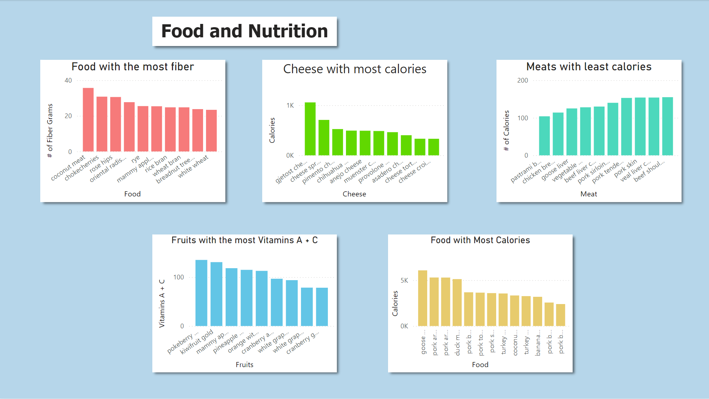
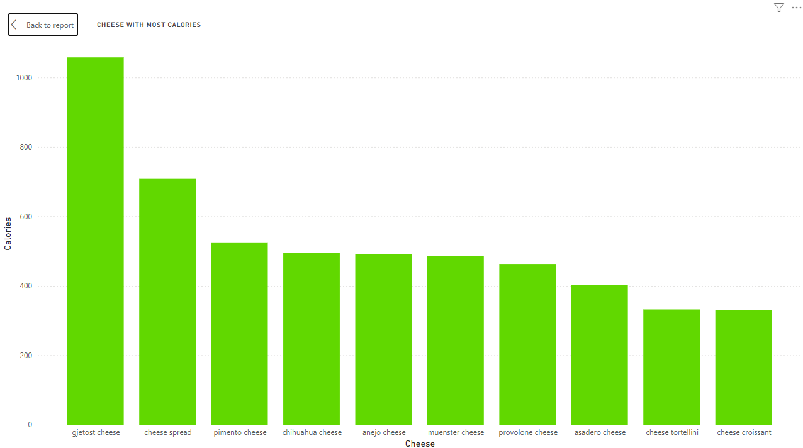
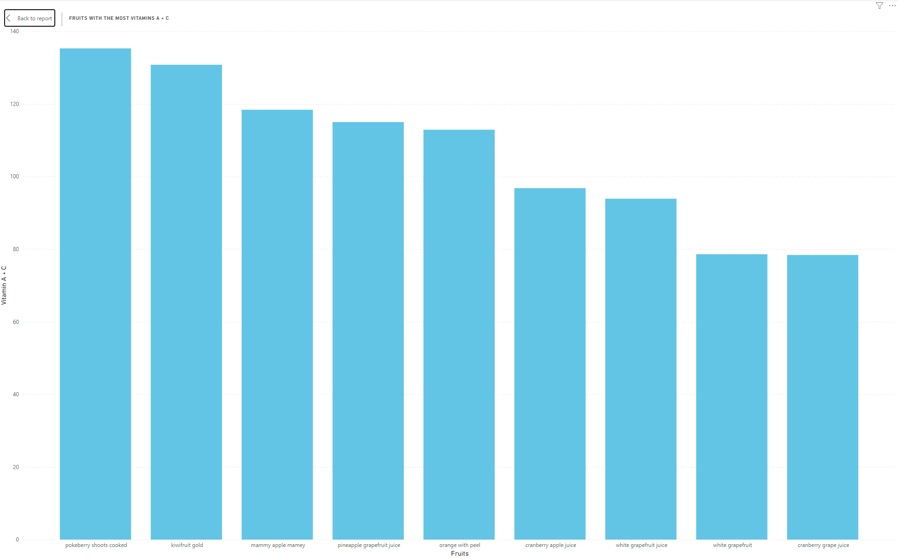

# Food-Nutrition

## Overview
- Different types of foods, their health values, calories, fiber content, and more.

## What is the reason for the project?
- Find healthier options for those who love products like cheese and meats
- Fruits that may help to recover from a cold full of vitamins A + C
- Foods to try to avoid when trying to keep the calories low

## Images

#Conclusion
- Found the cheese with the most amount of calories
- Found the meats with the least amount of calories for the meat lovers
- The healthiest fruits to help you recover with a lot of vitamins A + C

# Technologies
- This project was written mainly with Jupyter Notebook, Matplotlib, Python and Power Bi.

